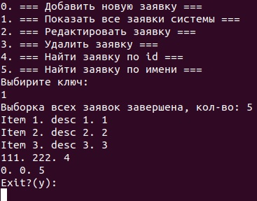

# job4j_tracker
Проект "Система заявок - трекер" представляет собой базовое консольное CRUD-приложение<br>
и демонстрирует принципы ООП.<br>

Пользователю отображается меню с возможностями программы.<br>

 <br>

## Как запустить приложение

что бы запустить приложение необходима программа Docker Compose

Проверяем наличие программы и, если её нет, устанавливаем.

[Установка Docker Compose](https://github.com/IvanPavlovets/job4j_mock/blob/master/01_installation/INSTALLATION.md)

### Запуск приложения
_Примечание: Все команды выполняем в терминале Linux_<br>
<br>
Склонируйте проект:
```
git clone https://github.com/IvanPavlovets/job4j_tracker.git
```
Перейдите в папку проекта:
```
cd job4j_tracker
```
Выполните команду создание образов проекта:
```
docker-compose build
```
или запустите все образы проекта (предварительно, выполниться команда создания):
```
docker-compose up -d
```
Запустим приложение:
```
docker-compose run job4j_tracker
```